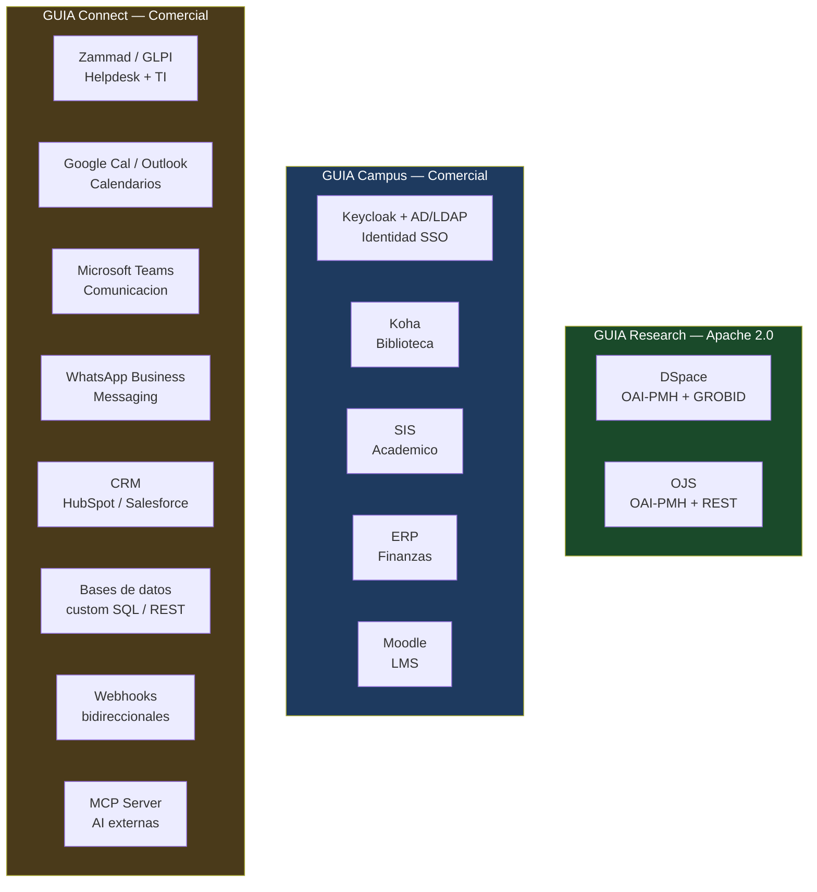

# Conectores

GUIA se conecta a los sistemas universitarios mediante conectores modulares. Cada conector implementa la interfaz `GUIAConnector`.

Los conectores estan organizados en tres capas segun el plan comercial:

---

## Capa 1 — Research (open source, Apache 2.0)

Conectores de contenido academico institucional. Disponibles en el plan **GUIA Research**.

### DSpace

| Campo | Detalle |
|-------|---------|
| **Protocolo** | OAI-PMH (`oai_dc` + `dim`) |
| **Versiones** | DSpace 5.x, 6.x, 7.x |
| **Datos** | Tesis, articulos, reportes, datasets |
| **Full-text** | GROBID para PDFs con bitstream accesible |
| **Plan** | Research (gratuito) |

Conector core. Cosecha metadatos Dublin Core + campos `renati.*` via OAI-PMH `dim`. Procesa PDFs completos con GROBID. Genera embeddings con `multilingual-e5-large-instruct`.

### OJS

| Campo | Detalle |
|-------|---------|
| **Protocolo** | OAI-PMH + REST API |
| **Versiones** | OJS 3.x |
| **Datos** | Articulos publicados, estado de envios del autor |
| **Plan** | Research (gratuito) |

Ademas de la cosecha OAI-PMH, consulta via REST API el estado de un envio del autor ("Mi articulo fue aceptado?").

---

## Capa 2 — Campus (licencia comercial SciBack)

Conectores de sistemas de gestion universitaria. Disponibles desde el plan **GUIA Campus**. Requieren que GUIA sepa quien es el usuario (Keycloak SSO).

### Keycloak + AD/LDAP (Identidad)

| Campo | Detalle |
|-------|---------|
| **Protocolo** | OIDC / LDAP / Microsoft Graph API |
| **Datos** | Usuario, roles, correo, grupos, credenciales |
| **Plan** | Campus |

Prerequisito de todos los conectores Campus. Sin identidad no hay personalizacion.

Preguntas tipicas:
- "Cual es mi correo institucional?"
- "Como cambio mi contrasena?"
- "Que permisos tengo en el sistema?"

### Koha (Biblioteca)

| Campo | Detalle |
|-------|---------|
| **Protocolo** | SIP2 / Koha REST API |
| **Datos** | Prestamos activos, deudas, disponibilidad, reservas |
| **Plan** | Campus |

Primer conector Campus. Preguntas tipicas:
- "Tengo libros pendientes de devolver?"
- "Esta disponible el libro de Sampieri?"
- "Cuantos dias me quedan para devolver?"
- "Tengo deudas en biblioteca que bloqueen mi egreso?"

### SIS — Sistema de Informacion Estudiantil

| Campo | Detalle |
|-------|---------|
| **Protocolo** | REST API (custom por SIS) |
| **Datos** | Matricula, notas, horarios, creditos, estado academico |
| **Plan** | Campus |
| **Nota** | Requiere implementacion custom por universidad |

Preguntas tipicas:
- "Ya salieron mis notas del parcial?"
- "Cual es mi horario del proximo ciclo?"
- "Cuantos creditos me faltan para egresar?"
- "En que estado esta mi solicitud de graduacion?"

### ERP — Finanzas

| Campo | Detalle |
|-------|---------|
| **Protocolo** | REST API (custom por ERP) |
| **Datos** | Estado de cuenta, pagos pendientes, recibos, fechas limite |
| **Plan** | Campus |
| **Nota** | Requiere implementacion custom por universidad |

Preguntas tipicas:
- "Cuanto debo de matricula?"
- "Cual es la fecha limite de pago?"
- "Ya se registro mi transferencia?"
- "Puedo descargar mi recibo del ultimo pago?"

### Moodle (LMS)

| Campo | Detalle |
|-------|---------|
| **Protocolo** | Moodle REST API |
| **Datos** | Cursos activos, tareas pendientes, calificaciones, foros |
| **Plan** | Campus |

Preguntas tipicas:
- "Que tareas tengo pendientes esta semana?"
- "Cual fue mi nota en el ultimo examen de estadistica?"
- "Cuando vence la entrega del proyecto final?"

---

## Capa 3 — Connect (licencia comercial SciBack)

Conectores de integracion extendida. Disponibles en el plan **GUIA Connect**. Habilitan acciones (no solo consultas) y conectan GUIA con el ecosistema AI externo via MCP.

### Zammad (Helpdesk)

| Campo | Detalle |
|-------|---------|
| **Protocolo** | Zammad REST API |
| **Datos** | Tickets abiertos, estado, historial, agentes asignados |
| **Plan** | Connect |

Acciones posibles:
- "El proyector del aula 301 no funciona — abre un ticket"
- "En que estado esta mi solicitud de correo institucional?"
- "Escala mi ticket al jefe de DTI"

### GLPI (Gestion de activos TI)

| Campo | Detalle |
|-------|---------|
| **Protocolo** | GLPI REST API |
| **Datos** | Activos asignados, tickets, inventario, licencias |
| **Plan** | Connect |

Acciones posibles:
- "Que equipos tengo asignados?"
- "Reporta una falla en mi laptop institucional"
- "Esta disponible una sala de computo?"

### Google Calendar / Outlook Calendar

| Campo | Detalle |
|-------|---------|
| **Protocolo** | Google Calendar API / Microsoft Graph API |
| **Datos** | Disponibilidad, eventos institucionales, reservas de sala |
| **Plan** | Connect |

Acciones posibles:
- "Reserva la sala de defensa de tesis para el viernes 15 a las 10am"
- "Agenda una reunion con mi asesor la proxima semana"
- "Que eventos institucionales hay en mayo?"
- "Recordame la fecha de cierre de actas"

### Microsoft Teams

| Campo | Detalle |
|-------|---------|
| **Protocolo** | Microsoft Graph API (Teams) |
| **Datos** | Canales, mensajes, reuniones, archivos |
| **Plan** | Connect |

Canal institucional para universidades con Microsoft 365. GUIA responde directamente en Teams.

### WhatsApp Business API

| Campo | Detalle |
|-------|---------|
| **Protocolo** | Meta Cloud API (via pywa) |
| **Datos** | Mensajes entrantes, notificaciones salientes |
| **Plan** | Connect (tambien disponible en Campus para consultas) |

Acciones posibles:
- Responder consultas de estudiantes via WhatsApp
- Notificaciones proactivas: "Tu libro vence manana. Renovar?"
- Alertas de fechas criticas: cierre de matricula, pagos, defensa

### CRM — HubSpot / Salesforce

| Campo | Detalle |
|-------|---------|
| **Protocolo** | HubSpot API / Salesforce REST API |
| **Datos** | Perfil del estudiante, lifecycle, interacciones, pipeline |
| **Plan** | Connect |

Casos de uso institucionales:
- "Cuantos estudiantes de ingenieria estan en riesgo de abandono?"
- "Que seguimiento tiene el prospecto que vino a la feria universitaria?"
- Automatizar onboarding de nuevos estudiantes

### Bases de datos custom

| Campo | Detalle |
|-------|---------|
| **Protocolo** | SQL directo (PostgreSQL, MySQL, Oracle, SQL Server) o REST API |
| **Datos** | Cualquier base de datos institucional |
| **Plan** | Connect |

Para sistemas propietarios o legacy que no tienen API estandar. GUIA puede consultar directamente con queries parametrizadas seguras (sin SQL injection).

### Webhooks y API custom

| Campo | Detalle |
|-------|---------|
| **Protocolo** | HTTP webhooks (entrada y salida) |
| **Uso** | Notificaciones bidireccionales con cualquier sistema externo |
| **Plan** | Connect |

Ejemplos:
- Cuando DSpace aprueba una tesis → GUIA notifica al autor por Telegram
- Cuando vence un pago → GUIA envia recordatorio por WhatsApp
- Cuando se resuelve un ticket → GUIA informa al estudiante en el canal de preferencia

### MCP Server

| Campo | Detalle |
|-------|---------|
| **Protocolo** | Model Context Protocol (Anthropic) |
| **Implementacion** | fastapi-mcp sobre los endpoints existentes de GUIA |
| **Plan** | Connect |

**El diferenciador mas estrategico de GUIA Connect.**

GUIA expone un servidor MCP que permite a cualquier AI externa (Claude Desktop, GPT custom actions, GitHub Copilot) consultar los sistemas de la universidad como herramientas nativas.

```
Claude Desktop del rector pregunta:
"Cual es la produccion cientifica de mi facultad de medicina este ano?"
→ Claude llama al MCP Server de GUIA
→ GUIA consulta DSpace + OJS + CRM
→ Respuesta con datos reales y citas
```

Esto convierte a GUIA en **la capa de inteligencia institucional** que cualquier asistente AI puede usar — no solo los usuarios directos del chat.

---

## Interfaz de conectores

Todos los conectores implementan la misma interfaz base:

```python
from guia.connectors.base import GUIAConnector, Result

class MiSistemaConnector(GUIAConnector):
    """Conector para MiSistema."""

    def search(self, query: str, user_context: dict) -> list[Result]:
        """Busqueda semantica o estructurada en el sistema."""
        ...

    def get_user_info(self, user_id: str) -> dict:
        """Informacion personalizada del usuario autenticado."""
        ...

    def get_status(self, user_id: str, entity: str) -> dict:
        """Estado de un proceso o entidad (prestamo, pago, ticket)."""
        ...

    def execute_action(self, action: str, params: dict, user_context: dict) -> dict:
        """Ejecutar una accion (abrir ticket, reservar sala, renovar libro)."""
        ...
```

Registrar en `config.yml`:

```yaml
connectors:
  - name: mi_sistema
    class: guia.connectors.mi_sistema.MiSistemaConnector
    tier: campus  # research | campus | connect
    config:
      api_url: https://mi-sistema.universidad.edu
      api_key: ${MI_SISTEMA_API_KEY}
```

---

## Mapa de conectores por plan


