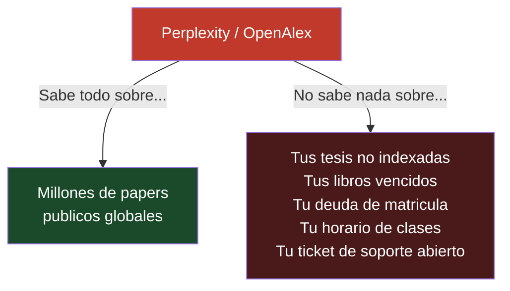
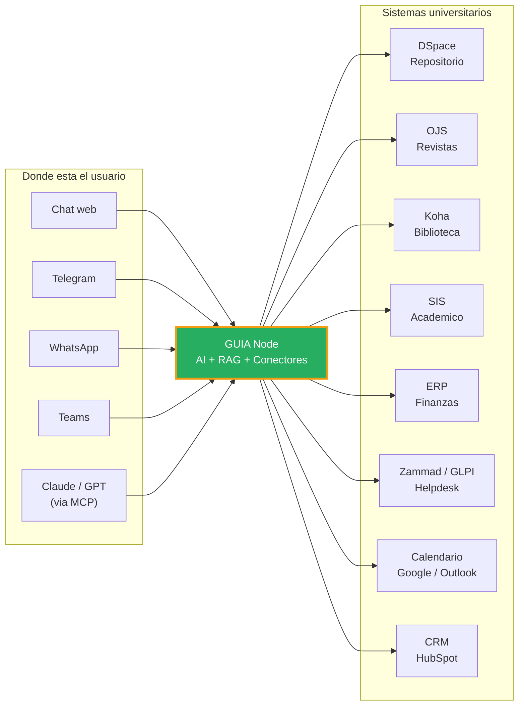
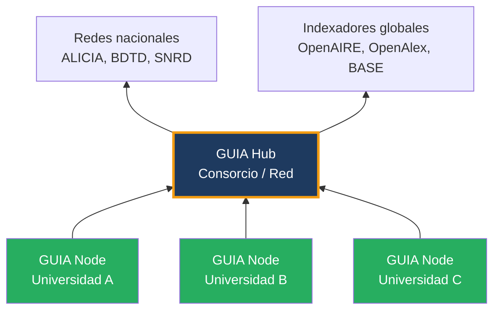

# GUIA

## Gateway Universitario de Informacion y Asistencia

*El sistema operativo AI de tu universidad — una sola conversacion para todo lo que necesitas saber*

---

## El problema real

**OpenAlex y Perplexity ya resolvieron la busqueda academica publica.**

Cualquier estudiante puede preguntar hoy en Perplexity "investigaciones sobre contaminacion del suelo en Peru" y obtener respuestas decentes, gratis, en segundos.

Pero eso no resuelve lo que le duele a tu universidad:

**Lo que no existe:** un asistente que conozca tu institucion — su produccion cientifica privada, sus sistemas de gestion, su gente — y que responda en lenguaje natural desde cualquier canal.

---

## La solucion: GUIA

GUIA es la capa de inteligencia institucional que conecta todo lo que tu universidad ya tiene.

---

## El recorrido de un estudiante

Una sola conversacion resuelve lo que antes requeria 8 sistemas distintos:

!!! example "Vispera de defensa de tesis"

    **Estudiante:** "Tengo mi defensa de tesis la proxima semana. Que necesito resolver?"

    **GUIA Research:**
    > "Encontre 52 tesis de tu programa en DSpace. Las 3 mas citadas sobre tu tema son..."

    **GUIA Campus:**
    > "Ademas, tienes un libro vencido en biblioteca (Hernandez Sampieri, vence manana) y hay un pago de $200 pendiente de matricula que bloquea tu egreso."

    **GUIA Connect:**
    > "Quieres que reserve la sala de defensa en el calendario? Puedo abrir un ticket para verificar el proyector y enviarte confirmacion por WhatsApp."

---

## Tres planes, un solo producto

-   **GUIA Research**

    La capa que falta entre tu repositorio y tus estudiantes.

    DSpace + OJS → RAG → chat en espanol con citas reales.
    Lo que Perplexity no puede ver: tu produccion institucional privada.

    [:fontawesome-solid-arrow-right: Ver plan](modelo-comercial.md#research)

-   **GUIA Campus**

    El asistente que conoce toda tu vida universitaria.

    Research + Koha + SIS + ERP + Moodle + Keycloak SSO.
    Una sola pregunta. Todos tus sistemas.

    [:fontawesome-solid-arrow-right: Ver plan](modelo-comercial.md#campus)

-   **GUIA Connect**

    El sistema operativo AI de tu universidad.

    Campus + Helpdesk + Calendarios + WhatsApp + Teams + CRM + MCP Server.
    Cualquier sistema. Cualquier canal. Cualquier AI externa.

    [:fontawesome-solid-arrow-right: Ver plan](modelo-comercial.md#connect)

---

## Por que no Perplexity ni EDS

| | OpenAlex + Perplexity | EBSCO EDS / Ex Libris Primo | **GUIA** |
|---|---|---|---|
| Contenido publico global | Excelente | Excelente | Bueno (via Hub) |
| **Tesis institucionales privadas** | No | Parcial | **Si** |
| **Sistemas de campus (SIS, Koha, ERP)** | No | No | **Si** |
| **Cumplimiento ALICIA / RENATI** | No | No | **Si** |
| **Accion** (abrir ticket, reservar sala) | No | No | **Si (Connect)** |
| Canal WhatsApp / Telegram | No | No | **Si** |
| Precio anual | Gratis | $20K-80K | **$0-18K** |
| Open source | Parcial | No | **Core si (Apache 2.0)** |

---

## Dos productos, un ecosistema

| Producto | Para quien | Que hace |
|----------|-----------|----------|
| **GUIA Node** | Cualquier universidad | Asistente AI que conecta todos los sistemas locales |
| **GUIA Hub** | Consorcios, redes, denominaciones | Federa nodos para busqueda unificada de investigacion |

!!! info "Separacion de datos"
    Los datos de campus (notas, pagos, prestamos) son **privados** y nunca salen del Node.
    Solo los datos de investigacion (tesis, articulos) federan hacia el Hub.

---

## Open source

GUIA es open-core:

- **Core Research:** Apache 2.0 — gratuito para siempre
- **Conectores Campus y Connect:** Licencia comercial SciBack
- **Hosting gestionado:** Suscripcion mensual

[:fontawesome-solid-arrow-right: Arquitectura](arquitectura.md){ .md-button .md-button--primary }
[:fontawesome-solid-arrow-right: Planes y precios](modelo-comercial.md){ .md-button }
[:fontawesome-solid-arrow-right: Conectores](conectores.md){ .md-button }
