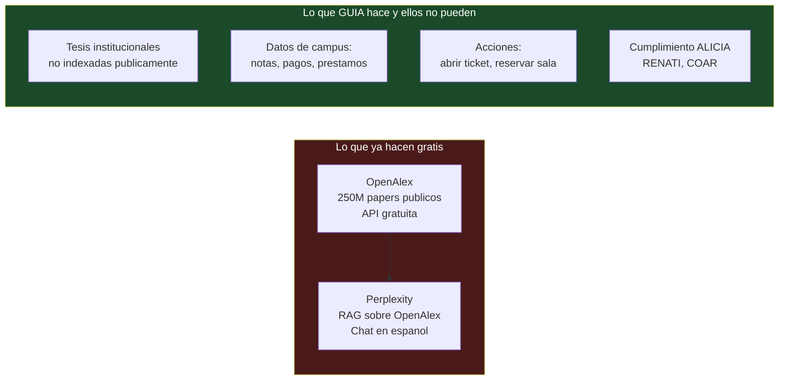
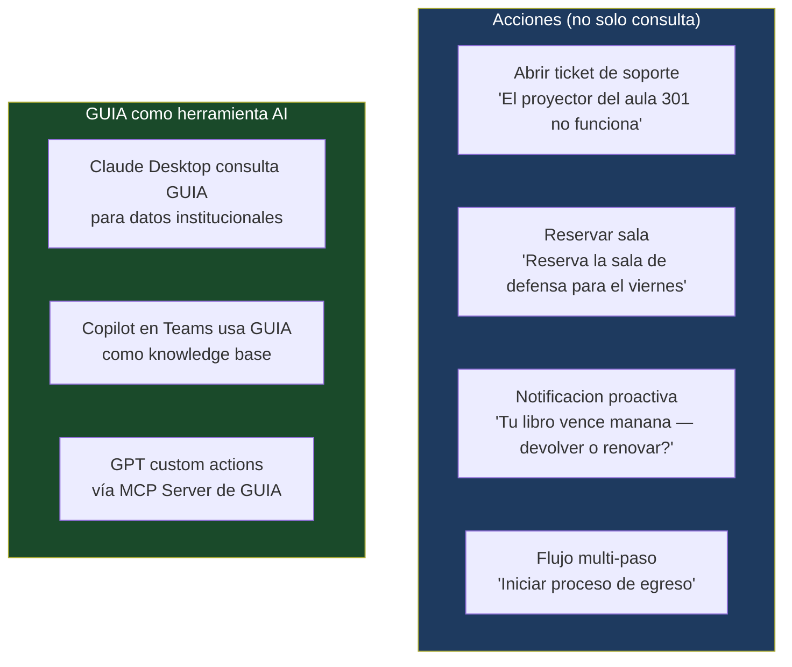
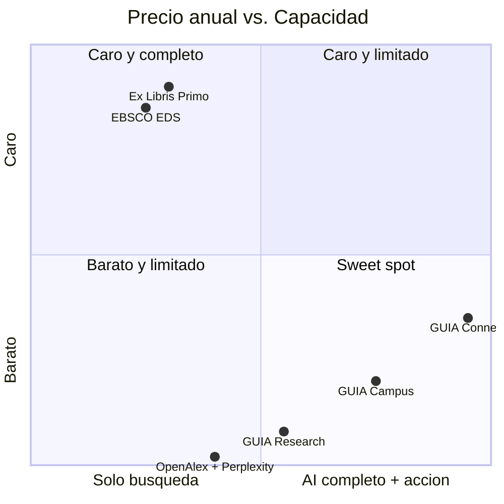
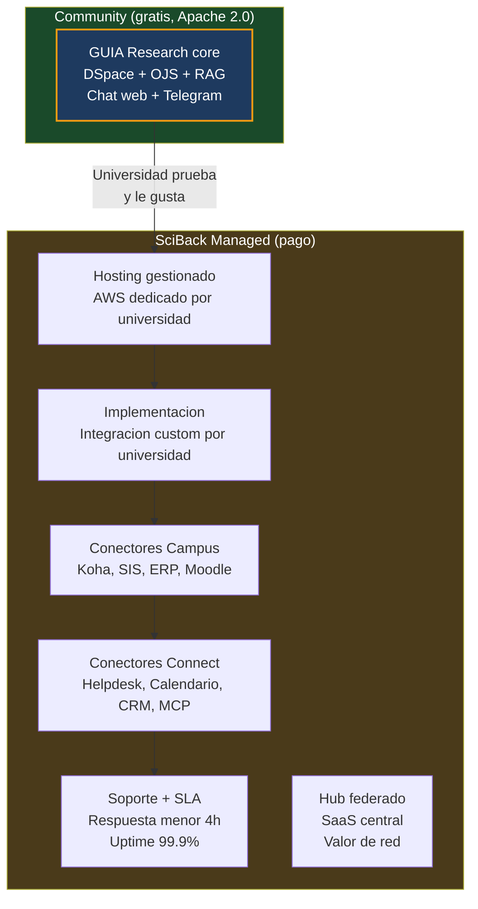

# Modelo Comercial

## El codigo es gratis. El servicio es el producto.

GUIA sigue el modelo open-core: el core de investigacion es gratuito y open source (Apache 2.0). SciBack vende **hosting gestionado**, **implementacion** y **conectores Campus/Connect** como servicios comerciales.

Modelo analogo a:

| Referencia | Gratis | Pago |
|-----------|--------|------|
| WordPress.org → WordPress.com | Software | Hosting gestionado |
| DSpace → DSpaceDirect (LYRASIS) | Software | Hosting + soporte |
| Keycloak → Red Hat SSO | Software | Soporte enterprise |
| **GUIA Community → SciBack Managed GUIA** | **Software** | **Hosting + implementacion + conectores** |

---

## Competencia directa

### Por que EDS y Primo ya no son el enemigo principal

EBSCO EDS y Ex Libris Primo son costosos ($20K-80K/ano) y las universidades LATAM no los pueden pagar. Eso ya es conocido. Pero el competidor real es otro:

### OpenAlex + Perplexity — el benchmark a superar

**La pregunta que GUIA responde y Perplexity no puede:**
> "Cuales son las tesis de mi universidad sobre agua potable que aun no estan en acceso abierto, y cuantas deudas de biblioteca tengo antes de poder egresar?"

Eso es el moat. Contenido institucional privado + datos de campus + cumplimiento normativo LATAM.

---

## Tres planes

### GUIA Research { #research }

**"La capa que falta entre tu repositorio y tus estudiantes"**

Lo que Perplexity no puede ver: la produccion cientifica privada de tu institucion.

| Componente | Detalle |
|-----------|---------|
| **Fuentes** | DSpace 5/6/7 + OJS 3.x via OAI-PMH |
| **RAG** | Full-text PDF (GROBID) + embeddings multilingues |
| **Chat** | Web (Chainlit) + Telegram |
| **Normativa** | ALICIA 2.1.0, RENATI/SUNEDU, COAR URIs |
| **Identidad** | Anonimo o login basico |
| **Licencia** | Apache 2.0 (self-hosted gratis) |

**Preguntas tipicas:**
- "Que tesis hay sobre inteligencia artificial en educacion?"
- "Cual es el abstract de la tesis de Juan Flores de 2023?"
- "En que estado esta mi articulo en la revista de ingenieria?"
- "Hay investigaciones recientes sobre mineria en Puno?"

**Pricing:**

| Modalidad | Precio | Incluye |
|-----------|--------|---------|
| Community | Gratis | Self-hosted, sin soporte |
| Managed Basic | $150-300/mes | SciBack hospeda y mantiene |
| Implementacion | $1K-2K (one-time) | Setup, configuracion OAI-PMH, primera ingesta |

---

### GUIA Campus { #campus }

**"El asistente que conoce toda tu vida universitaria"**

Research + identidad + sistemas de gestion. Un solo chat para todo.

| Componente | Detalle |
|-----------|---------|
| **Incluye** | Todo de Research |
| **Identidad** | Keycloak SSO + AD/LDAP/Google Workspace |
| **Biblioteca** | Koha (SIP2 / REST): prestamos, deudas, disponibilidad |
| **Academico** | SIS: matricula, notas, horarios, creditos |
| **Finanzas** | ERP: estado de cuenta, pagos, recibos |
| **LMS** | Moodle: tareas pendientes, calificaciones, cursos |
| **Canales** | Web + Telegram + WhatsApp |
| **Licencia** | Conectores Campus: licencia comercial SciBack |

**Preguntas tipicas:**
- "Tengo libros vencidos en biblioteca?"
- "Ya salieron mis notas del parcial de estadistica?"
- "Cuanto debo de matricula y cual es la fecha limite?"
- "Que tareas tengo pendientes en Moodle esta semana?"
- "Cual es mi horario del proximo ciclo?"
- "Como cambio mi contrasena del correo institucional?"

**Pricing:**

| Modalidad | Precio | Incluye |
|-----------|--------|---------|
| Managed Pro | $400-700/mes | Hosting + conectores activos |
| Implementacion | $2K-4K (one-time) | Integracion custom con SIS + ERP + Koha |

---

### GUIA Connect { #connect }

**"El sistema operativo AI de tu universidad"**

Campus + helpdesk + calendarios + canales institucionales + MCP Server. Cualquier sistema, cualquier canal, cualquier AI externa puede hablar con tu universidad.

| Componente | Detalle |
|-----------|---------|
| **Incluye** | Todo de Campus |
| **Helpdesk** | Zammad / GLPI: abrir tickets, consultar estado, escalar |
| **Calendarios** | Google Calendar / Outlook: reservar salas, eventos, recordatorios |
| **Comunicacion** | Microsoft Teams + WhatsApp Business API (Cloud Meta) |
| **CRM** | HubSpot / Salesforce: lifecycle estudiantil, seguimiento de leads |
| **Bases de datos** | Conectar cualquier DB via SQL o API REST custom |
| **Webhooks** | Notificaciones bidireccionales con cualquier sistema externo |
| **MCP Server** | GUIA como herramienta para Claude, GPT, Copilot — cualquier AI puede consultar tu universidad |
| **Hub** | Nodo federado: comparte investigacion con consorcios y redes nacionales |
| **Analytics** | Metabase: dashboards de uso, produccion cientifica, satisfaccion |
| **Licencia** | Conectores Connect: licencia comercial SciBack |

**Capacidades nuevas en Connect:**

**Preguntas y acciones tipicas:**
- "El proyector del aula 301 no funciona — abre un ticket de soporte"
- "Reserva la sala de defensa de tesis para el viernes a las 10am"
- "Agenda una reunion con mi asesor la proxima semana"
- "Cuantos estudiantes en riesgo academico tiene mi facultad?" (via CRM)
- "Notificame por WhatsApp cuando mi solicitud de grado sea aprobada"
- "Que eventos tiene la universidad este mes en el calendario institucional?"

**Pricing:**

| Modalidad | Precio | Incluye |
|-----------|--------|---------|
| Managed Enterprise | $800-1500/mes | Hosting + todos los conectores activos |
| Implementacion | $3K-6K (one-time) | Integracion con helpdesk + calendarios + MCP |
| Hub | +$200-500/mes | Federacion de nodos al Hub SciBack |

---

## Tabla comparativa completa

| Capacidad | Research | Campus | Connect |
|-----------|:--------:|:------:|:-------:|
| RAG sobre DSpace + OJS | ✅ | ✅ | ✅ |
| Full-text PDF (GROBID) | ✅ | ✅ | ✅ |
| ALICIA / RENATI compliance | ✅ | ✅ | ✅ |
| Chat web + Telegram | ✅ | ✅ | ✅ |
| WhatsApp Business | — | ✅ | ✅ |
| Microsoft Teams | — | — | ✅ |
| Keycloak SSO (identidad) | — | ✅ | ✅ |
| Koha (biblioteca) | — | ✅ | ✅ |
| SIS (academico) | — | ✅ | ✅ |
| ERP (finanzas) | — | ✅ | ✅ |
| Moodle (LMS) | — | ✅ | ✅ |
| Zammad / GLPI (helpdesk) | — | — | ✅ |
| Calendarios (Google / Outlook) | — | — | ✅ |
| CRM (HubSpot / Salesforce) | — | — | ✅ |
| Bases de datos custom | — | — | ✅ |
| Webhooks | — | — | ✅ |
| MCP Server | — | — | ✅ |
| Hub federado | — | — | ✅ |
| Analytics (Metabase) | — | — | ✅ |
| **Precio mensual (managed)** | **$150-300** | **$400-700** | **$800-1500** |
| **Precio anual estimado** | **$1.8K-3.6K** | **$4.8K-8.4K** | **$9.6K-18K** |

---

## vs. la competencia

| Producto | Precio anual | Datos institucionales privados | Campus (SIS/ERP/Koha) | Accion (tickets/calendario) | MCP / integracion AI |
|----------|-------------|:-----------------------------:|:---------------------:|:---------------------------:|:-------------------:|
| EBSCO EDS | $20K-50K | Parcial | No | No | No |
| Ex Libris Primo | $30K-80K | Parcial | No | No | No |
| OpenAlex + Perplexity | Gratis | **No** | No | No | No |
| **GUIA Research** | **$1.8K-3.6K** | **Si** | No | No | No |
| **GUIA Campus** | **$4.8K-8.4K** | **Si** | **Si** | No | No |
| **GUIA Connect** | **$9.6K-18K** | **Si** | **Si** | **Si** | **Si** |

---

## Fuentes de revenue

---

## Estructura de repositorios

| Repo | Visibilidad | Contenido | Licencia |
|------|------------|-----------|----------|
| `SciBack/guia` | PUBLIC | Docs + landing + sitio web | — |
| `SciBack/guia-node` | PUBLIC | Core Research: harvester, RAG, DSpace, OJS, chat, API | Apache 2.0 |
| `SciBack/guia-campus` | PRIVATE | Conectores Campus + Connect + Hub + midPoint | Comercial |
| `UPeU-Infra/guia-upeu` | PRIVATE | Config deploy UPeU (.env, overrides) | — |

El core open source debe ser **genuinamente util** standalone. Si Research es pobre, nadie lo prueba y no hay pipeline de clientes pagos.

---

## Mercado objetivo

### Tier 1 — Universidades individuales (GUIA Node)
- 118+ universidades adventistas (primer vertical por red personal de Alberto)
- ~1,800 universidades en America Latina (mercado amplio)
- Universidades en paises sin acceso a EDS/Primo por costo
- Universidades con mandato de repositorio institucional (Ley 30035 Peru, Res. 0777 Colombia)

### Tier 2 — Consorcios y redes (GUIA Hub)
- Consorcios universitarios: ALTAMIRA (Peru), CINCEL (Chile), ANUIES (Mexico)
- Redes denominacionales: IASD, catolicas, jesuiticas
- Sistemas universitarios estatales
- Redes tematicas: salud, teologia, ingenieria

---

## Pipeline de financiamiento

| Fuente | Monto | Para que | Estado |
|--------|-------|---------|--------|
| **NLnet NGI Zero Commons Fund** | **Hasta 50K EUR** | **Core Research open source** | **PRIORITARIO — deadline 1 jun 2026** |
| IOI Fund | Hasta $1.5M | Hub federado open science | Fase 2 |
| Mellon Foundation | $250K-500K | Core open source educacion superior | Fase 1 |
| SCOSS | Recurrente | Sostenibilidad cuando haya 50+ nodos | Fase 3 |
| Fondos gubernamentales | Variable | Universidades en paises con mandato OA | Por pais |
